# cold-clipper

## Introduction
See e.g. [this](https://robrobinette.com/How_the_Marshall_JCM800_Works.htm#Cold_Clipper)

The Cold Clipper is common in high(er) gain amps. It is (mostly) an unbypassed gain stage, often said to be biased cold and therefore easily clipping the signal and causing pleasant harmonic distortion. Over time I have come to question this statement.

## Triode gain stage

### Introduction
A selection of information about triode gain stages is presented here as a minimum. 

Other people have described the triode gain stage better than I ever could, please look [here](http://www.valvewizard.co.uk/Common_Gain_Stage.pdf) for more information: 

See 1.13 for cut-off clipping, but note that the cathode is fully bypassed.

### Plate Characteristic curves
The normal plate characteristic curves are for a tube in isolation.

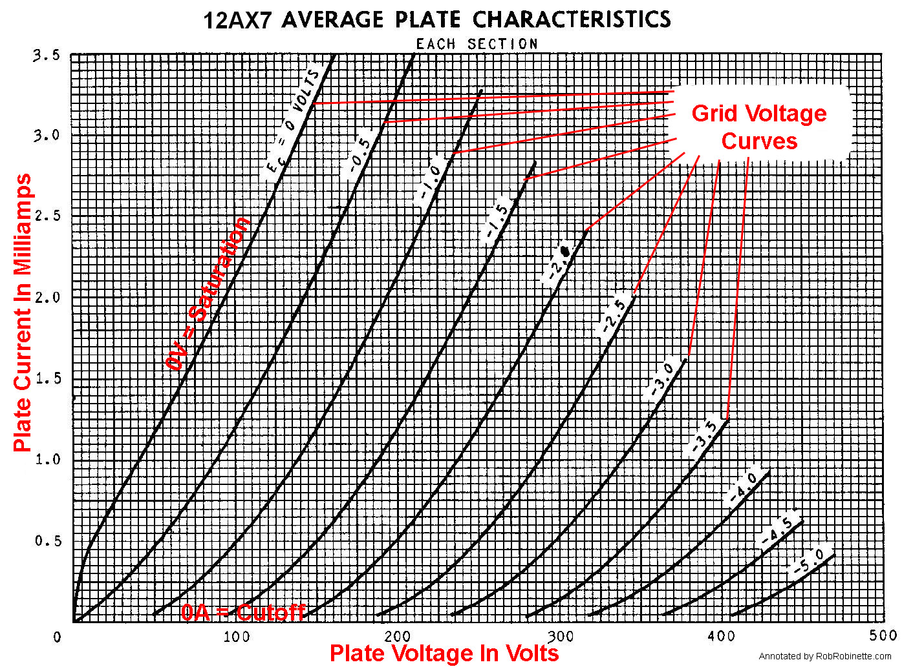

Taken from [here](https://robrobinette.com/Drawing_Tube_Load_Lines.htm)

### Biasing
Without further action, the tube would only pass/amplify the negative part of the signal, block the positive part and the output would be heavily distorted. In order to solve this, a negative DC has to be added to the input signal. Or, which has the same result, one has to bias the tube. The easiest way to do this conceptually is with a voltage source, e.g. a battery. Like this:

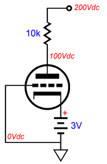

Problem solved. Tube will now amplify both the positive and negative half of the signal, until the signal gets too large and clipping will again occur. The battery will make sure the voltage at the cathode will always be 3V, independent of the current. So any fluctuating signal at the grid, which will cause a plate current fluctuation according to the plate curves characteristics, but the battery will sink it all and keep the cathode at 3V. At the cathode, the DC voltage is 3V, AC voltage is 0V.

### Bypassed cathode bias resistor
Enter the bypassed cathode resistor:

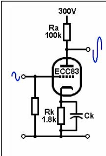

Taken from [here](http://www.valvewizard.co.uk/Common_Gain_Stage).

The cathode resistor Rk and cathode bypass capacitor Ck have exactly the same function as the battery: keep the cathode at a constant bias voltage. To keep the voltage at the cathode constant, the current through Rk has to be constant. That is the job of Ck: it 'eats' any AC current (shunts it to ground/averages it out/...). Rk's function is merely being a bias resistor.

### Unbypassed cathode bias resistor
Let's focus on the unbypassed gain stage:

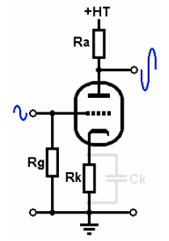

Taken from [here](http://www.valvewizard.co.uk/Common_Gain_Stage.pdf).

With no signal applied at the grid, Rk biases the tube. Business as usual. But as soon as the signal starts to fluctuate, the current through Rk also starts to fluctuate and you end up with a fluctuating signal in phase with the input signal. It is as if the bias battery has become some grid signal controlled voltage source. This means that the input signal (between grid and ground) is not completely present at Vgk (the voltage between grid and cathode). The tube sees a smaller Vgk which is amplified normally. However, this means that the input signal is amplified less as Vgk is smaller than the input signal. This is called cathode degeneration of local negative feedback.
Rk now has two functions: 1) it biases the tube, 2) it determines the amount of feedback (and thus gain).

The output signal waveform of the 1.5k, 10k and 39k unbypassed gain stage (cold clippers) looks very similar, apart from the obvious gain difference. Here you see them with two of them scaled to all have the same amplitude:

scaledColdClipperOutput.png

That means that independent of the Rk value, the gain stage starts to clip the output signal at the same input signal level. How is that possible?! Vgk is very different in those cases because of the feedback!
Well, the only current for which different resistors (Rk's) have the same voltage drop across them is zero current.

Simulations in ltspice showed that distortion set in at around 4V input signal. I used a 300V HT. If we then look at the -4V grid curve of the normal plate characteristics at 0mA, we see that we are at an HT of approx. 300V.

For the unbypassed gain stage, the plate characteristic curves had to be determined for each Rk specifically. I think we can say this a bit more precize: "The plate characteristic curves have to be determined for each amount of negative feedback specifically." The normal plate curve characteristic is just a special case of unbypassed: no feedback (Rk = 0R). Remember Rk has two functions in the unbypassed gain stage: bias & feedback. For the (fully) bypassed stage the bias is set by Rk, the (AC) feedback is determined by the resistance of Ck (which is zero for large enough caps). The two functions are divided over two components.

Taking this a step further in the bypassed stage: What if we use Rk to set the bias, but add an additional resistor in series with Ck? Then we would be able to set the bias with Rk and control the feedback (and thus gain) with the newly introduced resistor. Low and behold, someone else had thought of that already :)
Here is an image of that:

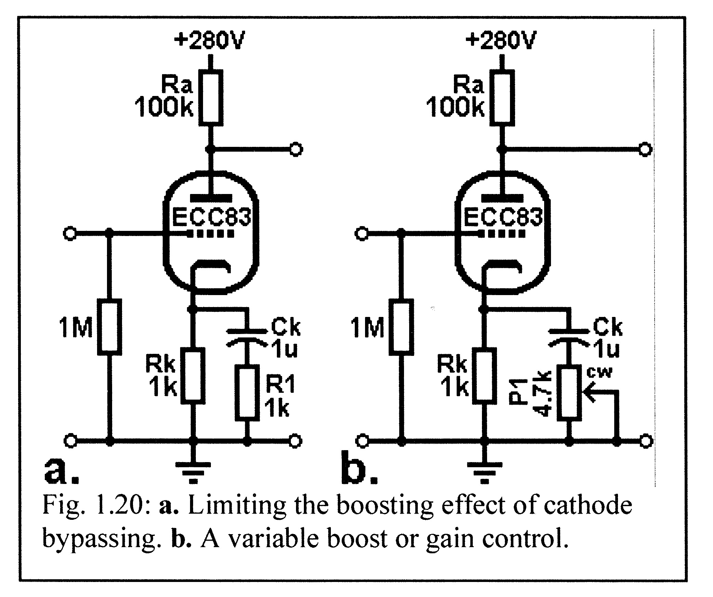

Looks like a Blencowe figure to me.

#### Conclusion
The plate characteristic curves have to be determined for each amount of negative feedback specifically. Fully bypassed is just no feedback.

### Unbypassed gain stage
The cold clipper in e.g. the JCM800 and SLO100 are unbypassed gain stages. To my surprise there is not much to be found on unbypassed gain stages. Blencowe mentions it a bit in 1.18 (of pdf above) and [here](http://valvewizard.co.uk/ChoosingBypassCaps.pdf) we can find the formula for the gain of the unbypassed gain stage. For the 'standard' 12AX7 unbypassed gain stage this simplifies to this approximation:

gain = 100000 / (1600 + Rk)

In graph form:

gain.png

See also this post by @Ten Over : https://www.tdpri.com/threads/blackface-ab763-experiment-high-gain-series-mod.1059543/#post-10862185

The best description I could find was from a 1945 book [Inside the Vacuum Tube][1]

The normal load line plots are for fully bypassed stages:

Cold_Clipper_Plate_Characteristics_Chart.jpg
(taken from RobRob's cold clipper page)

However, these load line plots are for the tube alone. The unbypassed cathode resistor alters the plate characteristic chart. As can be read in the 1945 book these plate (characteristic) curves have to be calculated for each cathode resistance separately. One can think of this as a special tube with the cathode resistor build in.

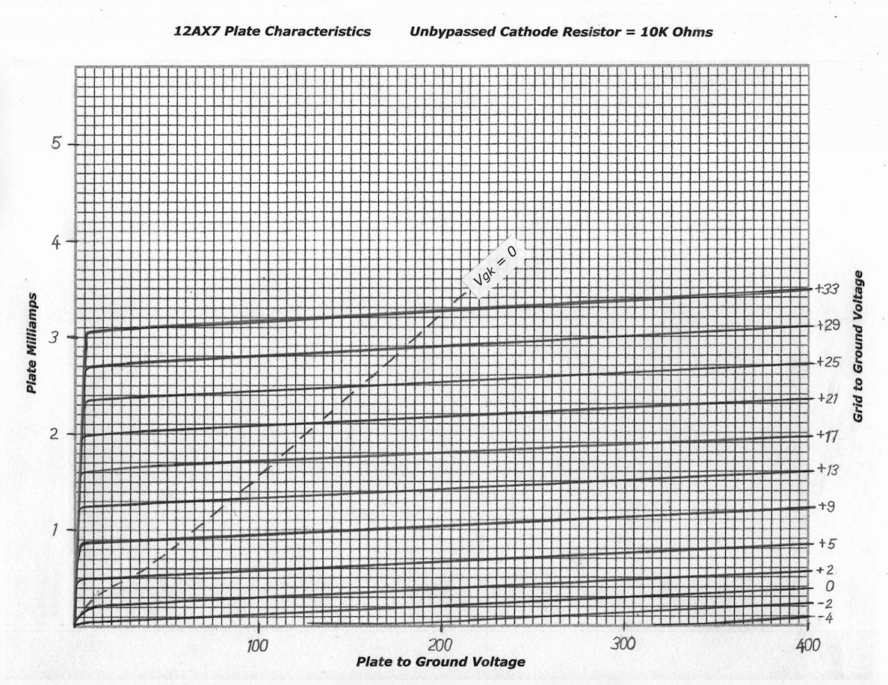

Notice the grid lines are closer together and more evenly spaced, indicating lower gain and improved linearity.

So a cold clipper gain stage (say 10k or 39k cathode resistor) is not nearly biased as cold as the fully bypassed gain stage load line suggests, but is mostly a low gain stage.

## Feedback

From wikipedia:

> A Negative-feedback amplifier (or feedback amplifier) is an electronic amplifier that subtracts a fraction of its output from its input, so that negative feedback opposes the original signal.[1] The applied negative feedback can improve its performance (gain stability, linearity, frequency response, step response) and reduces sensitivity to parameter variations due to manufacturing or environment. Because of these advantages, many amplifiers and control systems use negative feedback.

Designing Tube Preamps for Guitar and Bass also has a section about feedback.

Improved linearity until cut off is reached:

> "... This means that at the moment the valve enters cut-off the signal voltage actually appearing at the grid (which is normally reduced by the feedback signal) suddenly jumps to its full level, so the valve is immediately driven _very_ far into cut off."

## Experiments
I put my [JCM800 clone](https://www.tdpri.com/threads/jcm800-6v6-variant.1027817) on the bench. I applied an approximately 100mV RMS 1kHz signal to the high input.

### Cold Clipper

Amp settings:
Treble low, Middle mid, Bass low. Quite lossy.

Input (bottom trace) and output (top trace), after the coupling cap, of the Cold Clipper:
Oscilloscope settings:
Input: .5V/ div, 1ms/ div
Output: 2V/ div, 1ms/ div
Probes setting: x10

Solarized dark             |  Solarized Ocean
:-------------------------:|:-------------------------:
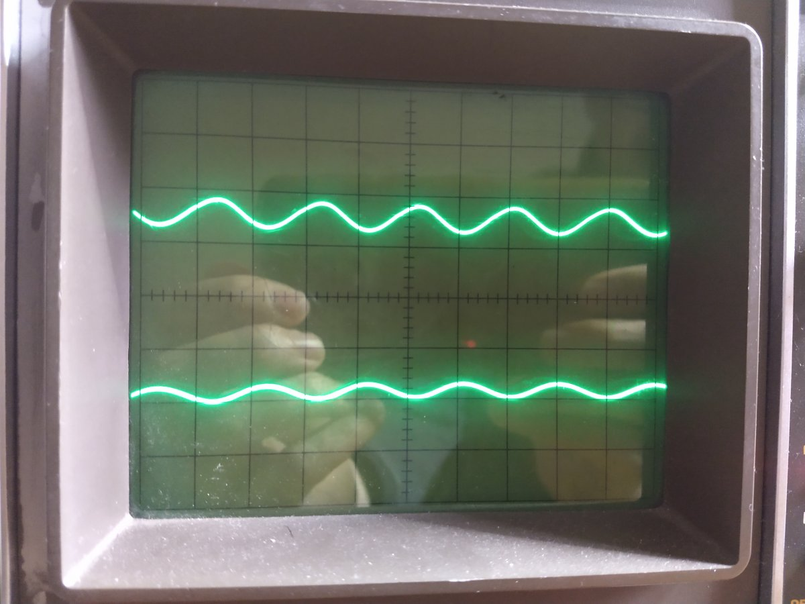 | 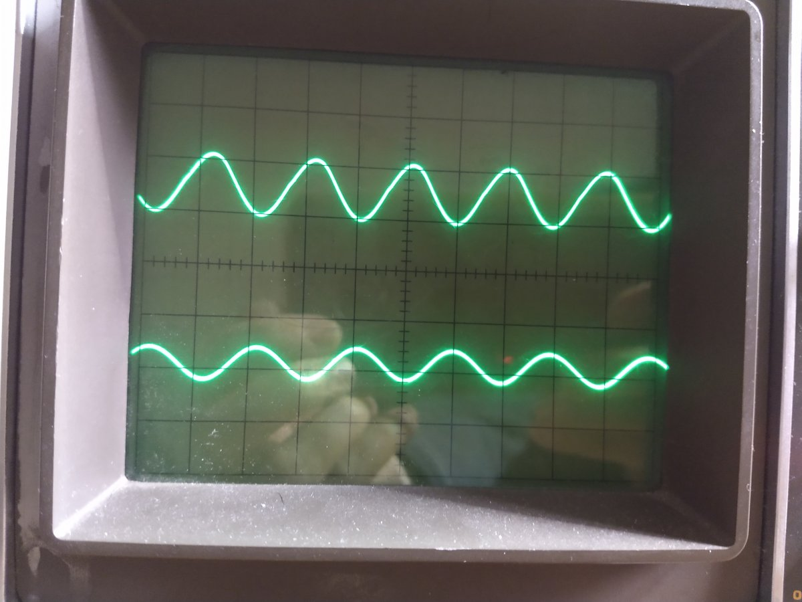
Gain at 9 o'clock. The output of the Cold Clipper looks slightly triangular. If I remember correctly, this is caused by the treble bleeder. | Gain at 12 o' clock. Still no obvious Cold Clipper distortion. Signal strength on scope differs by a factor of 2. Because of scope settings we have another factor of 4. Cold Clipper gain is approx. 8, which matches theory.
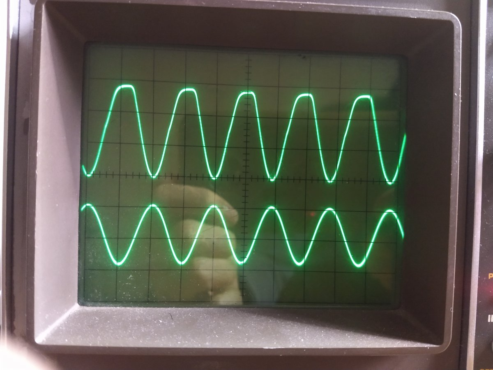 | 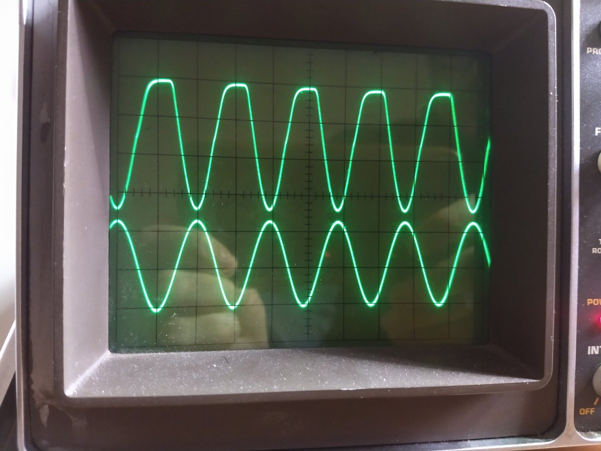
Gain at 3 o'clock. Finally we see some clear Cold Clipper distortion. | Gain at full. No comment.

### Warm stage and cathode follower

Cold Clipper output (top trace) and tone stack output (bottom trace):

Oscilloscope settings:
Input: 2V/ div, 1ms/ div
Output: 2V/ div, 1ms/ div
Probes setting: x10

Solarized dark             |  Solarized Ocean
:-------------------------:|:-------------------------:
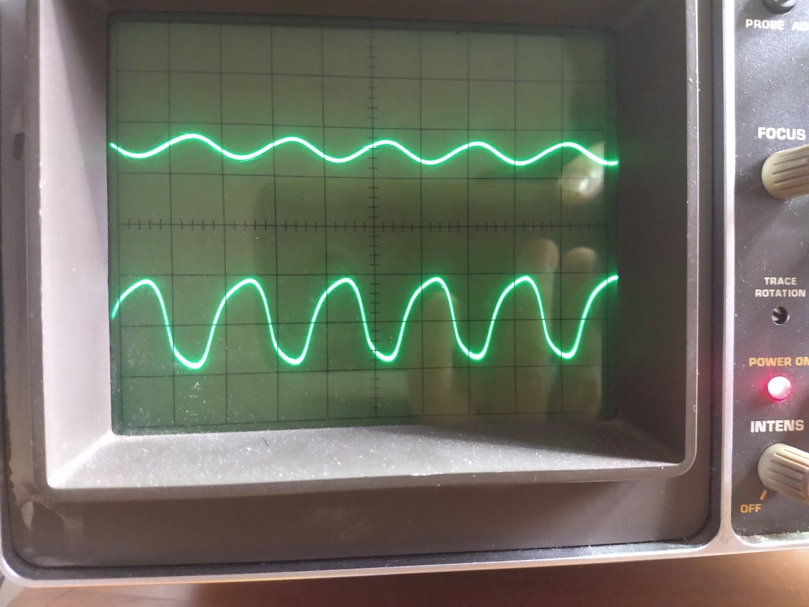 | 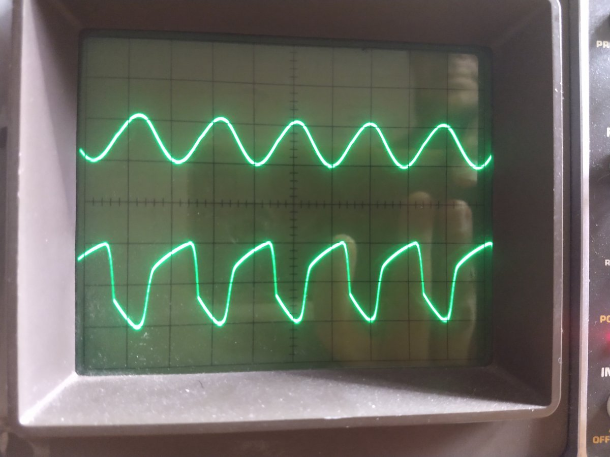
Gain at 9 o'clock. Already quite some distortion is visible, caused by the warm stage and the cathode follower. | Gain at 12 o' clock. Heavy distortion at the output of the tone stack, while the output of the Cold Clipper is still clean.
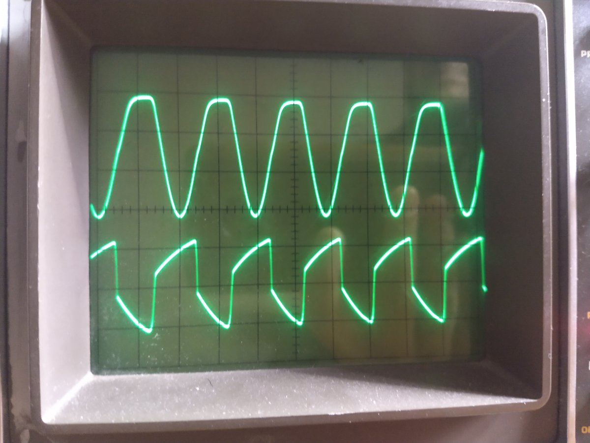 | 
Gain at 3 o'clock. Heavy distortion at the output of the tone stack. Output of Cold Clipper is also distorting. In my opinion it is questionable if the CC distortion significantly alters the waveform at the output of the tone stack. The actual shape and level of the tone stack output is (of course) heavily dependent on the TMB settings. | Note that while the Cold Clipper output signal increased, the signal level at the output of the tone stack stayed nearly the same and is now lower than the output of the Cold Clipper. A less lossy tone stack setting would have driven the LTP a bit harder. Maybe that (together with the post phase inverter volume) allows one to control the amount of LTP clipping? The bends are slightly sharper.

## Conclusion
Based on these experiments I would say that the contribution to the Cold Clipper to the overall distortion is small. Above all it is a low gain stage.

TODO: SOUND!

References:
Blencowe pdf
[1]: <https://worldradiohistory.com/Archive-Rider/BOOKS/Inside-the-Vacuum-Tube-Rider-1945.pdf > "Inside the Vacuum Tube Rider p.327 and further"

https://www.pearl-hifi.com/06_Lit_Archive/14_Books_Tech_Papers/Valley-Wallman/Valley_and_Wallman.pdf p426 and further.

http://tubebooks.org/Books/Preisman_graph.pdf p230 and further.