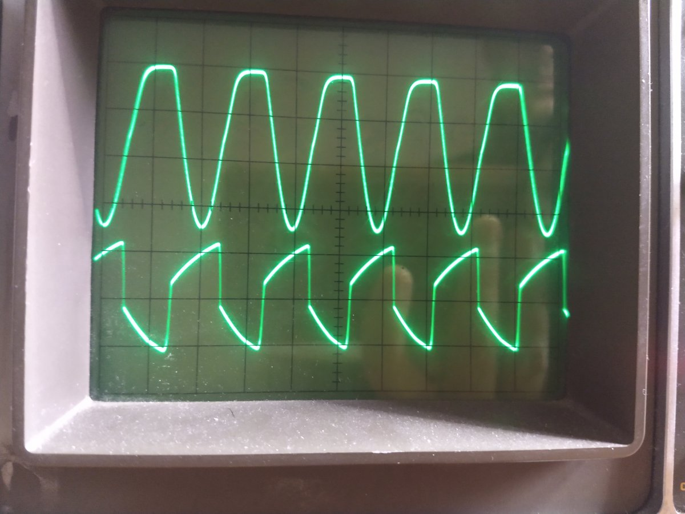

# cold-clipper

## Introduction
See e.g. https://robrobinette.com/How_the_Marshall_JCM800_Works.htm#Cold_Clipper by @robrob

The Cold Clipper is common in high(er) gain amps. It is an unbypassed gain stage, often said to be biased cold and therefore easily clipping the signal and causing pleasant harmonic distortion. Over time I have come to question this statement.

## Triode gain stage
Other people have described this better than I ever could: http://www.valvewizard.co.uk/Common_Gain_Stage.pdf

See 1.13 for cut-off clipping, but note that the cathode is fully bypassed.

## Unbypassed gain stage
The cold clipper in e.g. the JCM800 and SLO100 are unbypassed gain stages. To my surprise there is not much to be found on unbypassed gain stages. Blencowe mentions it a bit in 1.18 (of pdf above) and here (http://valvewizard.co.uk/ChoosingBypassCaps.pdf) we can find the formula for the gain of the unbypassed gain stage. For the 'standard' 12AX7 unbypassed gain stage this simplifies to this approximation:

gain = 100000 / (1600 + Rk)

In graph form:

gain.png

See also this post by @Ten Over : https://www.tdpri.com/threads/blackface-ab763-experiment-high-gain-series-mod.1059543/#post-10862185

The best description I could find was from a 1945 book: https://worldradiohistory.com/Archive-Rider/BOOKS/Inside-the-Vacuum-Tube-Rider-1945.pdf (p327 and futher)

The normal load line plots are for fully bypassed stages:

Cold_Clipper_Plate_Characteristics_Chart.jpg
(taken from RobRob's cold clipper page)

However, these load line plots are, dare I say it, useless for unbypassed gain stages. As can be read in the 1945 book these plate (characteristic) curves have to be calculated for each cathode resistance separately.

An example comparing theory (colored lines) vs. measurements (lines matches theory quite good) overlayed on the normal plate characteristics graph.

comp.png

taken from https://www.tdpri.com/threads/load-line-plotter-for-unbypassed-gain-stage.1032738/#post-9936085

And here is an example from LTSPiCE:

Cf8bWYH.png

So a cold clipper gain stage (say 10k or 39k cathode resistor) is not nearly biased as cold as the fully bypassed gain stage load line suggests, but is mostly a low gain stage.

An other example, now in the time domain, is this LTSPICE simulation where the output of a standard cold clipper is shown for a 4V input:

ColdClipper.png

(taken from https://www.tdpri.com/threads/blackface-ab763-experiment-high-gain-series-mod.1059543/#post-10861737)

## Experiments
I put my JCM800 clone on the bench ( https://www.tdpri.com/threads/jcm800-6v6-variant.1027817/ ). I applied a approximately 100mV RMS 1kHz signal to the high input.

Amp settings:
Treble low, Middle mid, Bass low. Quite lossy.

Input (bottom trace) and output (top trace), after the coupling cap, of the Cold Clipper:
Oscilloscope settings:
Input: .5V/div, 1ms/div
Output: 2V/div, 1ms/div
Probes setting: x10

IMG_20210818_191746951.jpg
Overview. Gain at 9 o' clock

No comment

===============================================================

IMG_20210818_191800945.jpg
Gain at 9 o' clock

The output of the Cold Clipper looks slightly triangular. If I remember correctly, this is caused by the treble bleeder.

===============================================================

IMG_20210818_191818748.jpg
Gain at 12 o' clock

Still no obvious Cold Clipper distortion. Signal strength on scope differs by a factor of 2. Because of scope settings we have another factor of 4. Cold Clipper gain is approx. 8, which matches theory.

================================================================

IMG_20210818_191828239.jpg
Gain at 3 o' clock

Finally we see some clear Cold Clipper distortion.

================================================================

IMG_20210818_191837366.jpg
Gain at full

No Comment.

===============================================================

Cold Clipper output (top trace) and tone stack output (bottom trace):

Oscilloscope settings:
Input: 2V/div, 1ms/div
Output: 2V/div, 1ms/div
Probes setting: x10

IMG_20210818_192058474.jpg
Gain at 9 o' clock

Already quite some distortion is visible, caused by the warm stage and the cathode follower.

===============================================================

IMG_20210818_192105206.jpg
Gain at 12 o' clock

Heavy distortion at the output of the tone stack, while the output of the Cold Clipper is still clean.

===============================================================

IMG_20210818_192112835.jpg
Gain at 3 o' clock

Heavy distortion at the output of the tone stack. Output of Cold Clipper is also distorting. In my opinion it is questionable if the CC distortion significantly alters the waveform at the output of the tone stack. The actual shape and level of the tone stack output is (of course) heavily dependent on the TMB settings.

===============================================================

Gain at full

Note that while the Cold Clipper output signal increased, the signal level at the output of the tone stack stayed nearly the same and is now lower than the output of the Cold Clipper. A less lossy tone stack setting would have driven the LTP a bit harder. Maybe that (together with the post phase inverter volume) allows one to control the amount of LTP clipping?

The bends are slightly sharper.

===============================================================

Conclusion
Based on these experiments I would say that the contribution to the Cold Clipper to the overall distortion is small. Above all it is a low gain stage.

References:
Blencowe pdf
1945 + other books

TODO
Formula:

$$V_in=V_g+V_k$$